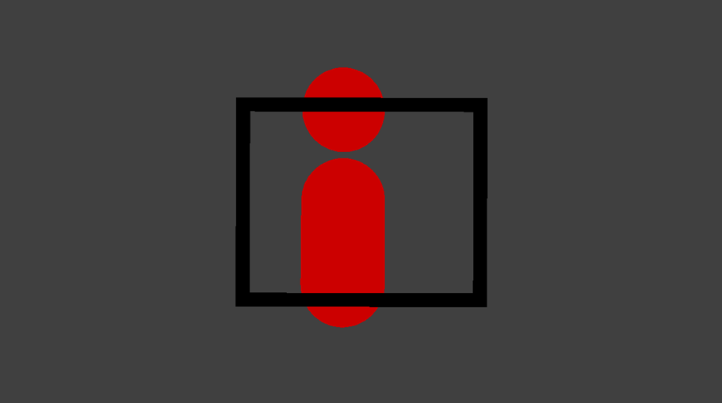

# AimTrainer

## 概要

- このゲームは、私が作成したエイム練習をするためのゲームです。

## 作品概要

- FPSのエイム練習を行うためのゲームです。特徴として、サイトに照準がありません。
- サイトの枠だけで狙うため、敵を大まかに狙う能力を鍛えられます。

## 遊び方

- 以下の方法で操作します。
  | 操作 | ゲーム内での動き |
  | ---- | ---- |
  | マウス移動 | 視点移動 |
  | マウス左クリック | 弾射出 |

- ゲームを起動すると赤色のオブジェクトが左右に移動しています。
- プレイヤーは赤色のオブジェクトに弾を当てることを目的とします。
- 弾が当たった際はヒット音が鳴ります。

- ゲーム動作参考映像
  - [制作物動作動画](制作物動作動画.mp4)

## 開発概要

- 開発期間
  - 2022年3月～2023年6月
- 開発メンバ
  | 役割 | メンバ|
  | ---- | ---- |
  | 企画 | 鶴田 淳 |
  | 開発 | 鶴田 淳 |
- 自身の担当範囲
  - 開発メンバにも記載した通り、企画・開発全て私が担当しました。

- 使用した技術
  - DirectX12
  - FBXSDK

- 著作物
  | 対象 | 著作者|
  | ---- | ---- |
  | ヒット音 | 魔王魂 |

- 苦労した点
  - DirectX12を用いたモデルを表示するまでの実装に苦労しました。グラフィックスパイプラインやシェーダなどの初めての概念が多く、  
    その上DirectX12の難解さも相まって苦労したことを覚えています。  
    数少ない書籍を購入し学習したり、Web上で公開されている実装方法などを参考にし、なんとか実装することが出来ました。
  - モデルの表示に成功した後の、ゲームを作る過程でも多くの苦労をしました。書籍はDirectX12の使い方は記されているのですが、  
    ゲーム自体の作り方は記されていなかったためです。そのため、赤色のオブジェクトを左右に動かす機能、弾を射出する機能、  
    カメラを動かす機能、当たり判定などは私が実装方法から検討する必要がありました。  
    対応方法として、機能ごとに実装方法の検討・設計を行った後、実装を行いました。  
    例えば弾を射出する機能では、マウスクリックを検出する処理、マウスクリック時に弾を射出する処理の2つを実装する必要があると検討しました。  
    その後必要な情報の調査を行いました。例えばマウスクリックを検出する処理に必要なライブラリの調査などです。  
    そして調査後に実装を行い、機能を完成させるというように進めることで、昨日の実装を進めることが出来ました。  

- 改善点
  - 1つの関数に複数の役割が与えられ、関数が長くなってしまっているケースが多く見られます。  
    メンテナンス性の観点から好ましくないため、修正の必要があると考えています。
  - スマートポインタを利用していないなど、古い書き方をしているケースが多く見られます。  
    安全性やメンテナンス性の観点から好ましくないため、修正の必要があると考えています。
  - クラスのメンバなどで定義できるにもかかわらず、グローバル変数として定義してしまっているケースが見られます。  
    バグの原因となってしまうことや、メンテナンス性の観点から修正の必要があると考えています。
  - マウスを斜めに動かしたときの視点の動き方がおかしいため、修正の必要があると考えています。
  - 現状、赤色のオブジェクトは左右に同じ速さ、同じタイミングで動くだけなため、挙動が単調になっています。  
    左右に切り返すタイミングをランダムにする、切り返すたびに速さを変更するなど、ランダム性を与える必要があると考えています。
  - エイム練習を行うことを目的としているゲームなため、ヒット率などのデータを可視化し、  
    どれだけ成長したかを可視化できるようにすべきだと考えています。
